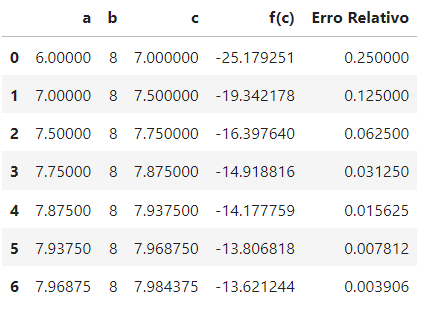
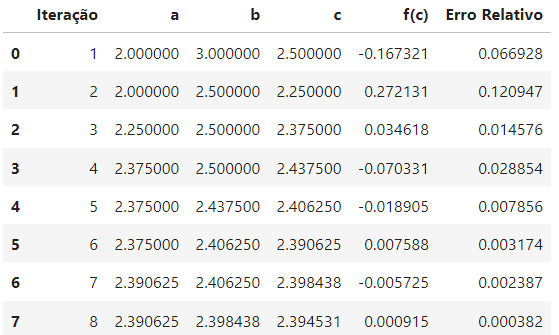
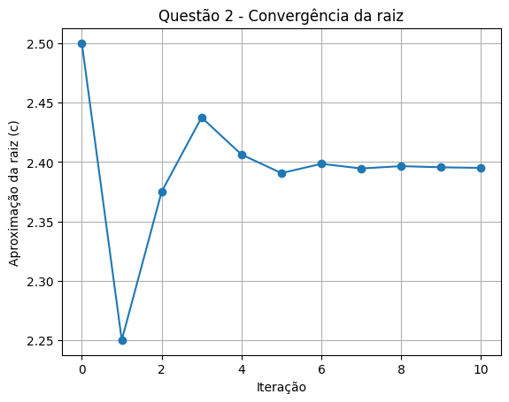
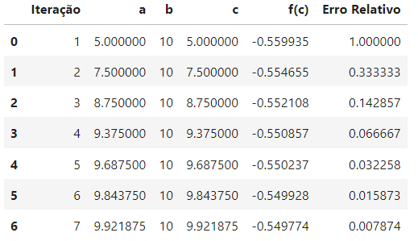
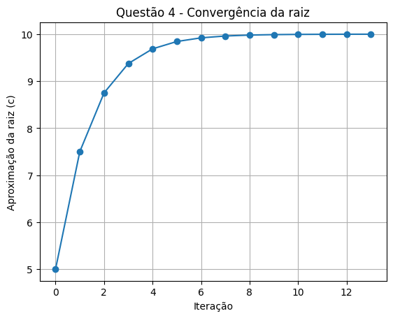

# Prova 1 Cálculo Numérico

- Aluno : Flávio Mesquita Marinho Filho
- Matrícula : 20230146390

# Relatório

- Foi utilizado o jupyter notebook com a linguagem python para resolução das questões 1, 2 e 4.

### Bibliotecas

- Numpy (usado para realizar os cálculos)
- Pandas (usado para gerar o dataframe)
- Math (usado para realizar operações matematicas)
- MatPlotLib (usado para gerar os gráficos)

# Questão 1

Para a resolução da questão 1 foi utilizado o método da bisseção.Com o intervalo de [6,8] foi analisado que os resultados obtidos foram raiz t=7,98 para v=100, sendo o erro de 8%.

No gráfico a seguir é visível a convergência indo para próxima de 7.98 ao aumentar o número de iterações (aumentei o número de iterações aumentando a taxa de erro)

# Questão 2

Para a resolução da questão 2 foi utilizado o método da bissecção. Com o intervalo de [2,3] foi analisado que a tensão na metade do cabo foi tensão = 2,39 com o erro de 1%.

No gráfico a seguir é visível a convergência indo para próxima de 2.39 ao aumentar o número de iterações (aumentei o número de iterações aumentando a taxa de erro)

# Questão 4

Para a resolução da questão 4 foi utilizado o método da bissecção. Com o intervalo inicial de [5,10] foi visto que a resistência se aproximava de 9.9 ou seja R = 9.99 com o erro menor que os 1%.

No gráfico é visto os pontos convergindo para valores proximos de raiz = 9.99.

